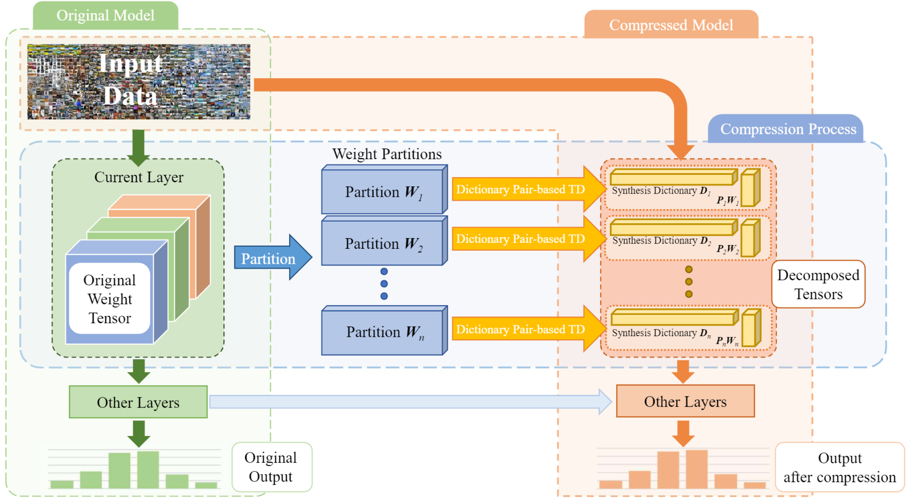

# This is the official repository for IEEE ICDM 2021 paper: ***Dictionary Pair-based Data-Free Fast Deep Neural Network Compression***



## How to run
```
sh run_DPL_Compress.sh
```

## How to modify configs for specific model
```
python update_configs.py --n_word=${n_words} --block_size=${block_size}
```

Noted that we implement evaluation on ImageNet with [**lmdb**](http://www.lmdb.tech/doc/), the code of [get_imagenet.py](utils/get_imagenet.py) should be modified to fit your environment.